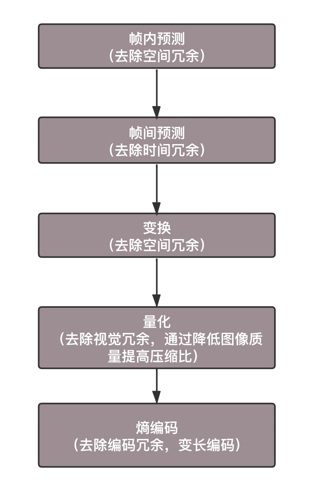

# audio-video

## questions
- B帧

## abbreviation
- sps : sequence parameter set
- pps : picture parameter set
- IDR帧（Instantaneous Decoding Refresh Picture）

## reference

[【codecs】音视频编解码开源项目大汇总](https://www.huaweicloud.com/articles/bca73e0ba03a22bc004ec3bf695130c2.html)
[视频点播](https://help.aliyun.com/document_detail/99380.html?spm=a2c4g.11186623.6.554.6b175fac3bQeEJ)

## 帧率
- 每一张图片，我们称为一帧。
- 只要每秒钟帧的数据足够多，也即播放得足够快。比如每秒 30 帧，以人的眼睛的敏感程度，是看不出这是一张张独立的图片的

## 码率、码流

- 码率（Bitrate）是指视频文件在单位时间内使用的数据流量，也叫码流或码流率
- 量度单位为“比特每秒”（bit/s或bps），常使用Kbps（每秒多少千个比特）或Mbps

## 编码

> 编码是一个压缩的过程

## 转码
- 视频转码（Video Transcoding）是指将已经压缩编码的视频码流转换成另一个视频码流，以适应不同的网络带宽、不同的终端处理能力和不同的用户需求。
- 转码本质上是一个先解码、再编码的过程，因此转换前后的码流可能遵循相同的视频编码标准，也可能不遵循相同的视频编码标准。

## 转封装
转封装指的是将视频或音频的封装格式进行转换，如将AVI的视频转换为MP4
- 其间并不会进行音视频的编码和解码工作，
- 而是直接将视频和音频压缩码流从一种封装格式文件中获取出来然后打包成另一种封装格式的文件
    - 处理速度极快--转封装不需要进行编码和解码
    - 音视频质量无损

## 频和图片的压缩过程特点
- 空间冗余：
    - 图像的相邻像素之间有较强的相关性，一张图片相邻像素往往是渐变的，不是突变的，没必要每个像素都完整地保存，可以隔几个保存一个，中间的用算法计算出来。
- 时间冗余：
    - 视频序列的相邻图像之间内容相似。
    - 一个视频中连续出现的图片也不是突变的，可以根据已有的图片进行预测和推断。
- 视觉冗余：
    - 人的视觉系统对某些细节不敏感，因此不会每一个细节都注意到，
    - 可以允许丢失一些数据。
- 编码冗余：
    - 不同像素值出现的概率不同，概率高的用的字节少，概率低的用的字节多，
    - 类似霍夫曼编码（Huffman Coding）的思路。

## 编码过程

> 用于编码的算法非常复杂，而且多种多样，但是编码过程其实都是类似的

## 视频编码的两大流派

- ITU（International Telecommunications Union）的 VCEG（Video Coding Experts Group）
    - 主要侧重传输
    - H.261、 H.262、H.263、H.264、H.265
- ISO（International Standards Organization）的 MPEG（Moving Picture Experts Group）
    - ISO 旗下的 MPEG，本来是做视频存储的。例如，编码后保存在 VCD 和 DVD 中。当然后来也慢慢侧重视频传输
    - MPEG-1、MPEG-2、MPEG-4、MPEG-7

- 经过编码之后，生动活泼的一帧一帧的图像，就变成了一串串让人看不懂的二进制
    - AVI、MPEG、RMVB、MP4、MOV、FLV、WebM、WMV、ASF、MKV
        - 就是视频保存成文件的格式
        - 前几个字节是什么意义，后几个字节是什么意义，然后是数据，数据中保存的就是编码好的结果

> ITU-T（国际电信联盟电信标准化部门，ITU Telecommunication Standardization Sector）与 MPEG 联合制定了 H.264/MPEG-4 AVC

## 视频播放器原理1

- 视频播放器播放一个互联网上的视频文件
    - 解协议，解封装，解码视音频，视音频同步
- 播放本地文件则不需要解协议
    - 解封装，解码视音频，视音频同步

## 视频播放器原理2

### 解协议

- 流媒体协议数据 -> 标准的相应的封装格式数据
    - e.g.  采用RTMP协议传输的数据，经过解协议操作后，输出FLV格式的数据
- 各种流媒体协议，例如HTTP，RTMP，或是MMS等等

### 解封装

- 封装格式的数据 -> 音频流压缩编码数据 + 视频流压缩编码数据
- 封装格式:
    - MP4，MKV，RMVB，TS，FLV，AVI等等
    - 作用: 将已经压缩编码的视频数据和音频数据按照一定的格式放到一起
        - e.g. FLV格式的数据 -> H.264编码的视频码流 + AAC编码的音频码流

### 解码

- 视频/音频压缩编码数据 -> 非压缩的视频/音频原始数据
- 编码标准
    - 音频: AAC，MP3，AC-3等等
    - 视频: H.264，MPEG2，VC-1等等
- 解码是整个系统中最重要也是最复杂的一个环节
    - 压缩编码的视频数据->非压缩的颜色数据，例如YUV420P，RGB等等
    - 压缩编码的音频数据->非压缩的音频抽样数据，例如PCM数据

### 音视频同步
- 根据解封装模块处理过程中获取到的参数信息，同步解码出来的视频和音频数据
- 将视频音频数据送至系统的显卡和声卡播放出来

## RTMP

## h.264

## h.265

