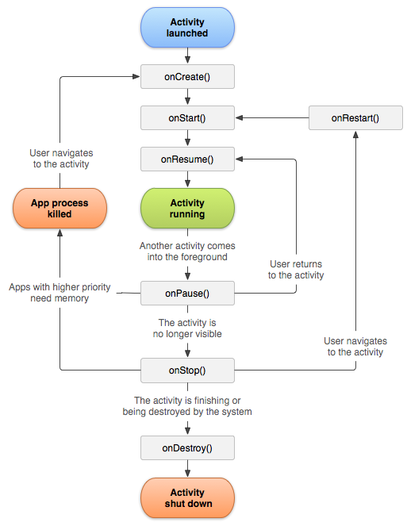

,,,,---
layout: post
title: "computer system1"
subtitle: "note"
date: 2021-08-08
author: "thomasliao"
header-img: "img/post-bg-2015.jpg"
tags:
    - Android
    - Anki
---

# Android

## context:class


## context:context数量
一般都认为是：activity数目+Service数目+Application数目。虽然activity和service，application都间接继承context。但是仅仅用来维护其生命周期。内部context的成员变量才是我们想要的上下文对象。


## context:context scope


### 如果我们用ApplicationContext去启动一个LaunchMode为standard的Activity的时候会报错
android.util.AndroidRuntimeException: Calling startActivity from outside of an Activity context requires the FLAG_ACTIVITY_NEW_TASK flag. Is this really what you want?


### 在Application和Service中去layout inflate也是合法的，但是会使用系统默认的主题样式，如果你自定义了某些样式可能不会被使用。所以这种方式也不推荐使用。


一句话总结：凡是跟UI相关的，都应该使用Activity做为Context来处理；其他的一些操作，Service,Activity,Application等实例都可以，当然了，注意Context引用的持有，防止内存泄漏。


### 一般Context造成的内存泄漏，几乎都是当Context销毁的时候，却因为被引用导致销毁失败，而Application的Context对象可以理解为随着进程存在的，所以我们总结出使用Context的正确姿势：

- 1：当Application的Context能搞定的情况下，并且生命周期长的对象，优先使用Application的Context。
- 2：不要让生命周期长于Activity的对象持有到Activity的引用。
- 3：尽量不要在Activity中使用非静态内部类，因为非静态内部类会隐式持有外部类实例的引用，如果使用静态内部类，将外部实例引用作为弱引用持有。

## Bitmap
Bitmap在android中指的是一张图片，可以是png格式也可以是jpe等其他常用格式


### Bitmap像素格式

- ALPHA_8：颜色信息只由透明度组成，占8位
- ARGB_4444：颜色信息由透明度与R（Red），G（Green），B（Blue）四部分组成，每个部分都占4位，总共占16位
- ARGB_8888：颜色信息由透明度与R（Red），G（Green），B（Blue）四部分组成，每个部分都占8位，总共占32位。是Bitmap默认的颜色配置信息，也是最占空间的一种配置
- RGB_565：颜色信息由R（Red），G（Green），B（Blue）三部分组成，R占5位，G占6位，B占5位，总共占16位


### Bitmap内存大小计算
图片长度 x 图片宽度 x 一个像素点占用的字节数


### 加载Bitmap

- decodeFile
   - 调用了decodeStream
- decodeResource
   - 调用了decodeStream
- decodeStream
- decodeByteArray


## Bitmap:高效加载Bitmap

- 通过采样率高效加载
   - 将BitmapFactory.Options的inJustDecodeBounds参数设为true并加载图片
      - BitmapFactory只会解析图片的原始宽/高信息，并不会去真正地加载图片，所以这个操作是轻量级的
   - 从BitmapFactory.Options中取出图片的原始宽高信息，它们对应于outWidth和outHeight参数
   - 根据采样率的规则并结合目标View的所需大小计算出采样率inSampleSize
   - 将BitmapFactory.Options的inJustDecodeBounds参数设为false，然后重新加载图片
- 内存复用
   - 在Bitmap中引入了一个新的字段BitmapFactory.Options.inBitmap，设置此字段为true后，解码方法会尝试复用一张存在的Bitmap
- 使用缓存
   - LruCache-LruCache作为Bitmap在内存中的存放容器
   - DiskLruCache-在sd卡则使用DiskLruCache来统一管理磁盘上的图片缓存
- 内存复用 + 缓存
   - 缓存中即将回收的使用弱引用(内存不足时会GC), 设置inBitmap来复用内存


## Bitmap:压缩图片
先尺寸压缩，后质量压缩，因为尺寸压缩可以设置`options.inJustDecodeBounds = true`仅获取 Bitmap 基本信息，几乎不占用应用程序的运行内存

- 质量压缩
   - 不改变图片的尺寸
   - `Bitmap.compress(CompressFormat format, int quality, OutputStream stream)`
      - 通过不断较少 quality 来限制文件大小
      - 假如图片特别大，当执行ByteArrayOutputStream.toByteArray() 这行时很可能 OOM
      - 所以质量压缩不能先执行
- 尺寸压缩
   - 一般用于生成缩略图
   - 通过缩放图片像素来减少图片占用内存大小
   - 获取图片的一些属性，例如图片宽高，图片类型等等（inJustDecodeBounds参数设为true）
      - 基于当前的上下文来决定怎么加载图片---完整、压缩、怎么压缩(采样率inSampleSize)
         - 完整图片加载到内存中所使用内存 vs 可分配内存
         - 显示图片的控件的大小
         - 当前设备的屏幕大小和密度
      - 计算采样率inSampleSize
         - Android 源码计算方式
         - 常规算法
         - luban


## Bitmap:局部加载
单个图片非常巨大，并且还不允许压缩。比如显示：世界地图、清明上河图、微博长图等

- [BitmapRegionDecoder](https://blog.csdn.net/lmj623565791/article/details/49300989)
- 根据屏幕大小将这个图切成N多块，要加载时根据屏幕滑动加载，类似于目前常用的谷歌地图方式
   - 还可以实现bitmap复用


## Bitmap: **getByteCount vs getAllocationByteCount**
### 一般情况下getByteCount()和getAllocationByteCount()是相等的。但是Bitmap内存如果复用之后，两者就不一样了

- getByteCount()代表存储Bitmap的色素需要的最少内存
- getAllocationByteCount()代表在内存中为Bitmap分配的内存大小

### 通过复用Bitmap来解码图片，如果被复用的Bitmap的内存比待分配内存的Bitmap大

- getByteCount()表示新解码图片占用内存的大小
- getAllocationByteCount()表示被复用Bitmap真实占用的内存大小


## Bitmap:Android Bitmap内存分配变化

- Android3.0之前， Bitmap对象放在Java堆，像素数据放在Native内存
   - 手动调用recycle释放
- Android3.0--Android7.0 对象和像素数据统一，放到Java堆中
   - 就算不调用recycle，Bitmap内存也会随对象一起被回收
   - Bitmap消耗内存大，所以放在Java堆比较容易导致OOM、大量GC
- Android 8.0 重新将 Bitmap 内存放回到 Native 中
- 优化3.0--7.0
   - 通过直接调用 libandroid_runtime.so 中 Bitmap 的构造函数，可以得到一张空的 Bitmap 对象，而它的内存是放到 Native 堆中
   - 通过系统的方法创建一张普通的 Java Bitmap
   - 将 Java Bitmap 的内容绘制到之前申请的空的 Native Bitmap 中
   - 将申请的 Java Bitmap 释放，实现图片内存的“偷龙转凤”。
   - 这个“黑科技”有两个主要问题，一个是兼容性问题，另外一个是频繁申请释放 Java Bitmap 容易导致内存抖动


## Bitmap:减少内存占用

- 使用采样 + RGB_565
   - **采样之后内存是小了，可是图的尺寸也小了，可以使用矩阵，内存不变，放大图片**

**
```java
//canvas
Matrix matrix = new Matrix();
matrix.preScale(2, 2, 0, 0);
canvas.drawBitmap(bitmap, matrix, paint);
//ImageView
Matrix matrix = new Matrix();
matrix.postScale(2, 2, 0, 0);
imageView.setImageMatrix(matrix);
imageView.setScaleType(ScaleType.MATRIX);
imageView.setImageBitmap(bitmap);
```

## Bitmap:内存优化

- 去除重复图片
   - 检查图片尺寸+bitmap数组进行hash对比
- 大图片监控
   - 插桩方式在setBitmap方法后拿到bitmap的宽高和view的宽高做比较
   - 定时去获取内存快照中view和bitmap中宽高作比较


## Activity lifecycle




> 注意，当系统因为内存不足（优先级更高的应用需要内存，请看上图红框）要回收Activity占用的资源时，Activity在执行完onPause()方法后就会被销毁，有些生命周期方法onStop()，onDestory()就不会执行。当再回到此Activity时，是从onCreate方法开始执行


## Activity lifecycle:生命周期

- onCreate
   - 表示activity正在被创建
   - 初始化工作：setContentView、初始化Activity需要的数据
- onRestart
   - 表示重新创建
   - Activity从不可见重新变为可见才会调用
   - 一般是用户所致，如按下home键
- onStart
   - 正在启动
   - Activity在后台--已经可见但是没出现在前台、无法和用户交互
   - 可以理解为Activity已经显示出来，但是我们看不到
- onResume
   - 已经可见，并且在前台开始活动
- onPause
   - 表示Activity正在停止
   - 可以做一些存储数据、停止动画等
   - 注意不能太耗时，会影响新Activity的显示--onPause必须执行完，新的Activity onResume才会执行
- onStop
   - 表示Activity即将停止
   - 可以做一些稍微重量级的回收工作，同样不能太耗时
- onDestroy
   - 表示Activity即将被销毁
   - 回收工作和最终的资源释放


> onStart和onStop是从Activity是否可见这个角度来回调的，而onResume和onPause是从Activity是否位于前台这个角度来回调的，除了这种区别，在实际使用中没有其他明显区别


## Activity lifecycle:生命周期切换过程

- 针对一个特定的Activity，第一次启动，回调如下：onCreate>onStart>onResume
- 打开新的Activity或者切换到桌面的时候，回调如下：onPause>onStop。
   - 特殊情况：如果新Activity采用了透明主题，那么当前Activity不会回调onStop
- 当用户再次回到原Activity时，回调如下：onRestart>onStart>onResume
- 当用户按back键回退时，回调如下：onPause>onStop>onDestroy
- pair
   - onCreate和onDestroy， 标识Activity的创建和销毁
   - 是否可见：onStart和onStop， 随着用户操作和设备屏幕点亮和熄灭，可能调用多次
   - 是否在前台: onResume和onPause, 随着用户操作和设备屏幕点亮和熄灭，可能调用多次


## Activity lifecycle:Activity异常结束

- 时机
   - 系统回收Activity
   - 设备的Configuration改变导致Activity销毁重建
      - 必须设置为android:configChanges="orientation|screenSize"时，不会重走生命周期
         - 只会回调onConfigurationChanged方法
- 流程
   - **onStop之前**回调**onSaveInstanceState**保存数据
   - **在onStart之后**回调**onRestoreInstanceState**
   - 其中Bundle数据会传到onCreate（不一定有数据）和onRestoreInstanceState（一定有数据）


```java
    /**
     * saveInstance 不一定有数据
     * @param saveInstance
     */
    @Override
    protected void onCreate(Bundle saveInstance) {
        super.onCreate(saveInstance);

        // Check whether we're recreating a previously destroyed instance
        if (saveInstance != null) {
            // Restore value of members from saved state
            mUser = saveInstance.getString(STATE_USER);
        } else {
            // Probably initialize members with default values for a new instance
            mUser = "NewUser";
        }
    }

    @Override
    protected void onSaveInstanceState(Bundle outState) {
        outState.putString(STATE_USER, mUser);
        //onStop之前调用
        // Always call the superclass so it can save the view hierarchy state
        super.onSaveInstanceState(outState);
    }

    @Override
    protected void onRestoreInstanceState(Bundle savedInstanceState) {
        super.onRestoreInstanceState(savedInstanceState);

        //不需要判断savedInstanceState， 在onStart后调用
        // Restore value of members from saved state
        mUser = savedInstanceState.getString(STATE_USER);
    }
```


[fragment](https://www.jianshu.com/p/dedbae8ffca1)

[service](https://www.jianshu.com/p/4c798c91a613)


## service lifecycle


## Service 本地、远程

- 本地服务
   - 该服务依附在主进程上而不是独立的进程
   - 不需要IPC，不需要AIDL
   - 应用被杀，service也会被杀
- 远程服务
   - 独立进程·
   - 对应进程名格式为所在包名加上你指定的android:process字符串。一般定义方式 android:process=":service"
   - Activity所在进程被Kill的时候，该服务依然在运行，不受其他进程影响


## Service状态

- 启动状态
   - **通过调用 startService() 启动服务时，**服务即处于“启动”状态
   - **一旦启动，服务即可在后台无限期运行，即使启动服务的组件已被销毁也不受影响，除非手动调用才能停止服务**
   - 如果想要启动一个后台服务长期进行某项任务，那么使用startService
   - _多次startService不会重复执行onCreate回调，但每次都会执行onStartCommand回调。_
   -  onCreate -> onStartCommand -> onDestory 
   - stopService
- 绑定状态
   - 调用 bindService() 绑定到服务时，服务即处于“绑定”状态
   - **绑定服务提供了一个客户端-服务器接口，允许组件与服务进行交互、发送请求、获取结果，甚至是利用进程间通信 (IPC) 跨进程执行这些操作**
   - 多个组件**可以同时绑定到该服务**，但**全部取消绑定后，该服务即会被销毁**
   - 如果只是短暂的使用，那么使用bindService。
   - onCreate -> onBind -> onUnbind -> onDestory
   - unbindService
- 对于既使用startService，又使用bindService的情况,Service的终止，需要unbindService和stopService都调用才行


## IntentService

> IntentService本质是采用Handler & HandlerThread方式

- 内部compose了ServiceHandler，并且在onCreate的时候创建新线程
- 重写其中的onHandleIntent(Intent)方法接收一个Intent对象,在适当的时候会停止自己(一般在工作完成的时候).
- onHandleIntent(Intent)执行在子线程


```java
public abstract class IntentService extends Service {
    private volatile Looper mServiceLooper;
    private volatile ServiceHandler mServiceHandler;
    private String mName;
    private boolean mRedelivery;

    private final class ServiceHandler extends Handler {
        public ServiceHandler(Looper looper) {
            super(looper);
        }

        @Override
        public void handleMessage(Message msg) {
            onHandleIntent((Intent)msg.obj);
            stopSelf(msg.arg1);
        }
    }
    
        @Override
    public void onCreate() {
        // TODO: It would be nice to have an option to hold a partial wakelock
        // during processing, and to have a static startService(Context, Intent)
        // method that would launch the service & hand off a wakelock.

        super.onCreate();
        HandlerThread thread = new HandlerThread("IntentService[" + mName + "]");
        thread.start();

        mServiceLooper = thread.getLooper();
        mServiceHandler = new ServiceHandler(mServiceLooper);
    }
```

```
//使用IntentService
    private void testIntentService() {
        String inputText = editText.getText().toString();
        Intent inputIntent = new Intent(ServiceActivity.this, MyIntentService.class);
        inputIntent.putExtra(MyIntentService.TEXT_INPUT, inputText);
        startService(inputIntent);
    }
```

## android broadcast

[Broadcast](https://blog.csdn.net/carson_ho/article/details/52973504?utm_medium=distribute.pc_relevant_right.none-task-blog-BlogCommendFromBaidu-1&depth_1-utm_source=distribute.pc_relevant_right.none-task-blog-BlogCommendFromBaidu-1)

- 广播接收者和广播发送者的执行是异步的
- 动态广播是在代码里注册的，静态广播是在AndroidManifest.xml（清单文件）中注册的。
   - 动态广播最好在Activity 的 onResume()注册、onPause()注销。
      - 对于动态广播，有注册就必然得有注销，否则会导致内存泄露
      - 不在onCreate() & onDestory() 或 onStart() & onStop()注册、注销
         - 内存不足Activity只跑onPause
   - 动态注册广播不是常驻型广播，也就是说广播跟随 Activity 的生命周期
      -  Activity 结束前，移除广播接收器
      - 可以根据自己需求特定时刻监听广播
   - 静态注册是常驻型，也就是说当应用程序关闭后，如果有信息广播来，程序也会被系统调用自动运行
      - 时刻监听广播
- 有序广播-Ordered Broadcast
   - 按照Priority属性值从大-小排序, Priority属性相同者，动态注册的广播优先
   - 先接收的广播接收者可以对广播进行截断，即后接收的广播接收者不再接收到此广播
   - 先接收的广播接收者可以对广播进行修改，那么后接收的广播接收者将接收到被修改后的广播
- 应用内广播
   - 将全局广播改为局部广播
      - 将exported属性设置为false
      - 在广播发送和接收时，增设相应权限permission，用于权限验证
      - 发送广播时指定该广播接收器所在的包名
         - 通过**intent.setPackage(packageName)**指定报名
   - 使用封装好的LocalBroadcastManager类
      - 对于LocalBroadcastManager方式发送的应用内广播，只能通过LocalBroadcastManager动态注册，不能静态注册

### 发送广播
- Context提供的如下两个方法用于发送广播。
   - 1.sendBroadcast()：发送Normal Broadcast。
   - 2.sendOrderedBroadcast()：发送Ordered Broadcast。

- Local

```
/**
* LocalBroadcast receiver used for inter-process communication which provides application security
* has it doesn’t allow other process to communicate.
*/
Intent broadcastIntent = new Intent();
broadcastIntent.setAction(ServiceActivity.ResponseReceiver.LOCAL_ACTION);
broadcastIntent.putExtra(TEXT_OUTPUT, outputText);
LocalBroadcastManager localBroadcastManager = LocalBroadcastManager.getInstance(this);
localBroadcastManager.sendBroadcast(broadcastIntent);
```


## 冷启动 vs 热启动
- 冷启动
   - 后台没有该应用的进程
   - 重新创建一个新的进程
      - 先创建和初始化Application类
      - 再创建和初始化`MainActivity`类（包括一系列的测量、布局、绘制），最后显示在界面上
- 热启动
   - 当应用已经被打开
   - 被按下返回键、Home键等按键时回到桌面或者是其他程序覆盖
   - 热启动的过程只需要创建和初始化一个`MainActivity`就行了，而不必创建和初始化`Application`
      - 直接走MainActivity（包括一系列的测量、布局、绘制）


## 冷启动流程

### Zygote进程 和 SystemServer进程

- Zygote进程
   - 应用程序进程都是由Zygote进程孵化出来的，而Zygote进程是由Init进程启动的
   - Zygote进程启动
      - 创建一个Dalvik虚拟机实例
      - 加载Java运行时库
      - 注册一些Android核心类的JNI方法来前面创建的Dalvik虚拟机实例中去

- SystemServer进程
   - SystemServer的进程名实际上叫做“system_server”
   - 系统中的服务驻留在其中,常见的比如WindowManagerServer（Wms）、ActivityManagerSystemService（AmS）、 PackageManagerServer（PmS）等，
      - 这些系统服务都是以一个线程的方式存在于SystemServer进程中
   - SS是由Zygote通过Zygote.forkSystemServer函数fork诞生出来的
      - init1()是native函数,启动了 c++运行时库,如：sqllite,OpenGL ES等,然后把调用线程加入Binder通信中
      - nit2在Java层,就是单独创建一个线程,用以启动系统各项服务:Wms, Ams, Pms等

### 启动流程

Application构造方法 –> `attachBaseContext()`–>`onCreate` –>Activity构造方法 –> `onCreate()` –> 配置主体中的背景等操作 –>`onStart()` –> `onResume()` –> 测量、布局、绘制显示


- 点击app图标，从Zygote进程fork创建新进程给应用
   - 点击桌面App图标，Launcher进程采用Binder IPC向system_server进程发起startActivity请求
   - system_server进程接收到请求后，向zygote进程发送创建进程的请求；
   - Zygote进程fork出新的子进程，即App进程；
- 依次创建和初始化Application类、创建MainActivity类、加载主题样式Theme中的windowBackground等属性设置给MainActivity以及配置Activity层级上的一些属性
   - App进程，通过Binder IPC向sytem_server进程发起attachApplication请求；
   - system_server进程在收到请求后，进行一系列准备工作后，再通过binder IPC向App进程发送scheduleLaunchActivity请求
   - App进程的binder线程（ApplicationThread）在收到请求后，通过handler向主线程发送LAUNCH_ACTIVITY消息
   - 主线程在收到Message后，通过反射机制创建目标Activity，并回调Activity.onCreate()等方法
   - 到此，App便正式启动，开始进入Activity生命周期，执行完onCreate/onStart/onResume方法，UI渲染结束后便可以看到App的主界面


## Activity启动流程

- Activity1调用startActivity，实际会调用Instrumentation类的execStartActivity方法，Instrumentation是系统用来监控Activity运行的一个类，Activity的整个生命周期都有它的影子
- 通过跨进程的binder调用，进入到ActivityManagerService中，其内部会处理Activity栈，通知Activity1 Pause，Activity1 执行Pause 后告知AMS
- 在ActivityManagerService中的startProcessLocked中调用了Process.start()方法。并通过连接调用Zygote的native方法forkAndSpecialize，执行fork任务。之后再通过跨进程调用进入到Activity2所在的**进程**中
- ApplicationThread是一个binder对象，其运行在binder线程池中，内部包含一个H类，该类继承于类Handler。主线程发起bind Application，AMS 会做一些配置工作，然后让主线程 bind ApplicationThread，ApplicationThread将启动Activity2的信息通过H对象发送给**主线程**。发送的消息是EXECUTE_TRANSACTION，消息体是一个 ClientTransaction，即 LaunchActivityItem。主线程拿到Activity2的信息后，调用Instrumentation类的newActivity方法，其内通过ClassLoader创建Activity2**实例**
- 通知Activity2去performCreate


注：现在发送的都是EXECUTE_TRANSACTION ，通过 TransactionExecutor 来执行 ClientTransaction, ClientTransaction 中包含各种 ClientTransactionItem，如 PauseActivityItem、LaunchActivityItem、StopActivityItem、ResumeActivityItem、DestroyActivityItem 等，这些Item的execute方法来处理相应的handle，如handlePauseActivity、handleLaunchActivity等，通知相应的Activity来perform。

## Serializable-Java

### cons

- reflection - slow
- standard Java interface
- creates a lot of temporary objects and causes quite a bit of garbage collection

### pros

- easier to implement


```java
public class ItemSerializable implements Serializable {
    private String name;
    private int age;
    public ArrayList<String> address;

    public ItemSerializable(String name, int age, ArrayList<String> address) {
        super();
        this.name = name;
        this.age = age;
        this.address = address;
    }

    public ArrayList<String> getAddress() {
        if (!(address == null))
            return address;
        else
            return new ArrayList<String>();
    }

    public String getName() {
        return name;
    }

    public int getAge() {
        return age;
    }
}
```


## Parcelable
### cons

- takes more time to implement


### pros

- faster
- array can be passed via Intent in android
- no reflection, 选择字段读写
- kotlin有注解


```kotlin
@Parcelize
data class Item(
        val title: String,
        val price: Double,
        val imageUrl: String,
        val category: Category
) : Parcelable

@Parcelize
data class Category(
        val tag: String
) : Parcelable
```

- java编写稍微复杂


```java
public class ItemParcelable implements Parcelable {

    private int age;
    private String name;
    private ArrayList<String> address;

    public ItemParcelable(String name, int age, ArrayList<String> address) {
        this.name = name;
        this.age = age;
        this.address = address;
    }

    public ItemParcelable(Parcel source) {
        age = source.readInt();
        name = source.readString();
        address = source.createStringArrayList();
    }

    @Override
    public int describeContents() {
        return 0;
    }

    @Override
    public void writeToParcel(Parcel dest, int flags) {
        dest.writeInt(age);
        dest.writeString(name);
        dest.writeStringList(address);
    }

    public int getAge() {
        return age;
    }

    public String getName() {
        return name;
    }

    public ArrayList<String> getAddress() {
        if (!(address == null))
            return address;
        else
            return new ArrayList<String>();
    }

    public static final Creator<ItemParcelable> CREATOR = new Creator<ItemParcelable>() {
        @Override
        public ItemParcelable[] newArray(int size) {
            return new ItemParcelable[size];
        }

        @Override
        public ItemParcelable createFromParcel(Parcel source) {
            return new ItemParcelable(source);
        }
    };
}
```


### construct


```java
Class clazz = Class.forName(activity);
Intent intent = new Intent(MainActivity.this.getApplicationContext(), clazz);
Item item = new Item("hello", 888, "testing", new Category("tag"));
intent.putExtra("primitive Int", 888);
intent.putExtra("item",item);

ArrayList<String> arrayList = new ArrayList<>();
arrayList.add("dddddddd");

ItemParcelable mObjects = new ItemParcelable("name", 99, arrayList);
intent.putExtra("itemParcelable",mObjects);

ItemSerializable itemSerializable = new ItemSerializable("name", 99, arrayList);
intent.putExtra("itemSerializable", itemSerializable);

startActivity(intent);
```


### getdata


```kotlin
        val item = intent.getParcelableExtra<Item>("item")
        val java = intent.getParcelableExtra<ItemParcelable>("itemParcelable")
        val itemSerializable = intent.getSerializableExtra("itemSerializable") as ItemSerializable
```


## View: structure


- DecorView是一个应用窗口的根容器，它本质上是一个FrameLayout
- DecorView有唯一一个子View，它是一个垂直LinearLayout，包含两个子元素，
   - 一个是TitleView（ActionBar的容器），
   - 另一个是ContentView（窗口内容的容器）


## Activity.setContentView
这个方法只是完成了Activity的ContentView的创建，而并没有执行View的绘制流程。

- 实际上调用到了PhoneWindow的setContentView()方法。
- PhoneWindow的setContentView()方法中
   - 调用了LayoutInflater的inflate()方法来填充布局
   - 传入了decorView作为LayoutInflater.inflate()的root参数
   - 最终调用的是inflate(XmlPullParser, ViewGroup, boolean)方法来填充布局
      - 单独处理merge标签
      - 调用rInflate()方法来递归填充布局
         - inflate()和rInflate()方法中都调用了rInflateChildren()方法
         - rInflateChildren()方法实际上调用了rInflate()方法


## View: inflate方法总结

- XML中保存了ViewTree的结构和View的相关标签信息（包括View的类型和一些属性值）
   - 这些信息会在后面通过反射的方式（如果没有Factory2和Factory的话）创建实例对象
      - 如果创建的是ViewGroup，则会对它的子View遍历重复创建步骤
      - 创建完View对象后，会add到对应的ViewGroup中
- inflate->rInflate->createViewFromTag->createView


## View: view绘制的起点

- View的绘制是由ViewRoot来负责的。每个应用程序窗口的decorView都有一个与之关联的ViewRoot对象，这种关联关系是由WindowManager来维护的。
- 当建立好了decorView与ViewRoot的关联后，ViewRoot类的requestLayout()方法会被调用，以完成应用程序用户界面的初次布局。实际被调用的是ViewRootImpl类的requestLayout()方法
   - setContentView() 只是把 View 添加到 DecorView 上
   - onResume() 中 ViewRootImpl 和 DecorView 做了关联
   - requestLayout() 和 invalidate() 会触发 ViewRootImpl 绘制 View
   - 在 Activity 的 onResume() 方法执行后，DecorView 会被添加带 ViewRootImpl 中。然后执行 requestlayout()
```java
//H:Handler->handleMessage(RESUME_ACTIVITY)->handleResumeActivity->windowmanager.addView
public void addView(View view, ViewGroup.LayoutParams params,
        Display display, Window parentWindow) {
    ……

    ViewRootImpl root;
    View panelParentView = null;

    synchronized (mLock) {
        ……
        root = new ViewRootImpl(view.getContext(), display);

        view.setLayoutParams(wparams);

        mViews.add(view);
        mRoots.add(root);
        mParams.add(wparams);
    }

    // do this last because it fires off messages to start doing things
    try {
        root.setView(view, wparams, panelParentView); //invoke requestLayout
    } ……
}
```


## View: MeasureSpec
> exactly优先，at_most次之

MeasureSpec代表一个32位int值，

- 高2位代表SpecMode，SpecMode是指测量模式，
   - UNSPECIFIED, 指父容器不对view有任何限制，要多大给多大，一般用于系统内部，表示测量的状态
   - EXACTLY, 父容器检测出view需要的精确大小，view的最终大小就是SpecSize的大小。对应LayoutParams中的match_parent模式
   - AT_MOST,父容器指定了一个SpecSize, view的大小不能大于这个值, 对应LayoutParams.wrap_content模式
- 低30位代表SpecSize，而SpecSize是指在某种测量模式下的规格大小
- MeasureSpec 不是 唯一 由 LayoutParams 决定 的， LayoutParams 需 要和 父 容器 一起 才能 决定 View 的 MeasureSpec， 从而 进一步 决定 View 的 宽/ 高
   - if(view固定宽/高)-- 不受父容器，View的MeasureSpec==EXACTLY，并且大小遵循LayoutParams中的大小
   - if(view宽/高是match_parent)
      - if 父容器是EXACTLY, view=EXACTLY，大小是父类的剩余空间
      - if 父容器是AT_MOST，view=AT_MOST，不能超过父容器的剩余空间
   - if(view宽/高是wrap_content),不受父容器影响，view=AT_MOST，不能超过父容器的剩余空间
> 
> UNSPECIFIED-主要 用于 系统 内部 多次 Measure 的 情形， 一般来说， 我们 不需要 关注 此 模式。


- 对于DecorView，其MeasureSpec由窗口的尺寸和其自身的LayoutParams来共同确定
- 对于普通View，其MeasureSpec由父容器的MeasureSpec和自身的LayoutParams来共同决定，MeasureSpec一旦确定后，onMeasure中就可以确定View的测量宽/高


## View: 三阶段


## View: 获取宽高的时机
> 在onCreate、onStart、onResume中均无法正确得到某个View的宽/高信息，这是因为View的measure过程和Activity的生命周期方法不是同步执行的，因此无法保证Activity执行了onCreate、onStart、onResume时某个View已经测量完毕了，如果View还没有测量完毕，那么获得的宽/高就是0

- Activity/ View# onWindowFocusChanged, 
- view. post( runnable), 
- ViewTreeObserver, 
- view. measure( int widthMeasureSpec, int heightMeasureSpec), 根据 View 的 LayoutParams 来 分情况，是否有效
   - match_parent, 直接放弃，无效
   - 具体数值(dp/px)--ok
   - wrap_content--ok


```kotlin
object ViewUtil {

    /**
     * view的layoutparams指定了宽高，可以通过这个方法来获取真实宽高, 譬如100px
     */
    fun measureViewOfExactly(view: View) {
        val widthMeasureSpec = View.MeasureSpec.makeMeasureSpec(100, EXACTLY)
        val heightMeasureSpec = View.MeasureSpec.makeMeasureSpec(100, View.MeasureSpec.EXACTLY)
        view.measure(widthMeasureSpec, heightMeasureSpec)
    }

    /**
     * view的layoutparams是wrap_content，可以通过这个方法来获取真实宽高
     */
    fun measureViewOfWrapContent(view: View) {
        val widthMeasureSpec = View.MeasureSpec.makeMeasureSpec((1 shl 30) - 1, AT_MOST)
        //view的 尺寸 使用 30 位 二进制 表示， 也就是说 最大 是 30 个 1（ 即 2^ 30 - 1）， 也就是( 1 << 30) - 1， 在最 大化 模式 下， 我们 用 View 理论上 能 支持 的 最大值 去 构造 MeasureSpec 是 合理 的。
        val heightMeasureSpec = View.MeasureSpec.makeMeasureSpec((1 shl  30) - 1, AT_MOST)
        view.measure(widthMeasureSpec, heightMeasureSpec)
    }
}
```


   - 错误用法关于 View 的 measure， 网络 上有 两个 错误 的 用法。 为什么 说是 错误 的， 首先 其 违背 了 系统 的 内部 实现 规范（ 因为 无法 通过 错误 的 MeasureSpec 去 得出 合法 的 SpecMode， 从而 导致 measure 过程 出错）， 其次 不能 保证 一 定能 measure 出 正确 的 结果。


```java
//第一 种 错误 用法： 
int widthMeasureSpec = MeasureSpec. makeMeasureSpec(- 1, MeasureSpec. UNSPECIFIED); 
int heightMeasureSpec = MeasureSpec. makeMeasureSpec(- 1, MeasureSpec. UNSPECIFIED); 
view. measure( widthMeasureSpec, heightMeasureSpec); 

//第二 种 错误 用法： 
view. measure( LayoutParams. WRAP_ CONTENT, LayoutParams. WRAP_ CONTENT)

```


### View的测量宽/高和最终宽/高有什么区别
在View的默认实现中，View的测量宽/高和最终宽/高是相等的，只不过测量宽/高形成于View的measure过程，而最终宽/高形成于View的layout过程，即两者的赋值时机不同，测量宽/高的赋值时机稍微早一些。因此，在日常开发中，我们可以认为View的测量宽/高就等于最终宽/高，但是的确存在某些特殊情况会导致两者不一致

## View: layout

- 当ViewGroup的位置被确定后，它在onLayout中会遍历所有的子元素并调用其layout方法，在layout方法中onLayout方法又会被调用。
- layout方法确定View本身的位置，而onLayout方法则会确定所有子元素的位置，


## View: draw

- view的绘制过程
   - 绘制 背景 background. draw( canvas)
   - 绘制 自己（ onDraw）
   - 绘制 children（ dispatchDraw）
   - 绘制 装饰（ onDrawScrollBars）
- invalidate(), 请求重绘 View 树，即 draw 过程，假如视图发生大小没有变化就不会调用`layout()`过程，并且只绘制那些调用了`invalidate()`方法的 View
- requestLayout(), 当布局变化的时候，比如方向变化，尺寸的变化，会调用该方法，在自定义的视图中，如果某些情况下希望重新测量尺寸大小，应该手动去调用该方法，它会触发`measure()`和`layout()`过程，但不会进行 draw。

## touch event:点击事件的传递规则

- public boolean dispatchTouchEvent( MotionEvent ev) -- 进行事件的分发
- public boolean onInterceptTouchEvent( MotionEvent event) -- 是否拦截事件
- public boolean onTouchEvent( MotionEvent event) -- 处理点击事件


```java
public boolean dispatchTouchEvent( MotionEvent ev) { 
    boolean consume = false; 
    if (onInterceptTouchEvent( ev)) { 
        consume = onTouchEvent( ev); 
    } else { 
        consume = child. dispatchTouchEvent( ev); 
    } 
    return consume; 
}
```


- ViewGroup
   - onIntercepTouchEvent返回true，拦截当前事件，事件会交给该ViewGroup处理
   - onIntercepTouchEvent返回false，不拦截当前事件，事件会传递给子元素处理，子元素的dispatchTouchEvent方法会被调用
- View
   - 设置了onTouchListener， onTouchListener优先级比onTouchEvent要高
      - onTouchListener的onTouch返回true， view的onTouchEvent不会被调用
      - onTouchListener的onTouch返回false， view的onTouchEvent会被调用
   - 没有设置onTouchListener，则调用onTouchEvent
   - 如果设置了onClickListener，那么会调用其onClick方法--OnClickListener优先级最低，处于事件的末端
- 传递过程：Activity->Window->View。顶级view收到事件后会按照事件分发机制分发事件
   - 如果一个View的onTouchEvent返回false，那么父容器的onTouchEvent将会被调用


```kotlin
  //重写父类的onTouchEvent 
  override fun onTouchEvent(event: MotionEvent?): Boolean {

        Log.d("testing", "just testing")

        return super.onTouchEvent(event)
    }
  
  //setOnTouchListener
      fun setOnTouchEventListenerTest() {
        this.setOnTouchListener(object : OnTouchListener {
            override fun onTouch(v: View?, event: MotionEvent?): Boolean {
                //do something

                //如果返回true， view的onTouchEvent 就不会被调用，
                //可见 OnTouchListener 的 优先级 高于 onTouchEvent， 这样做的好处是方便在外界处理点击 事件。
                return false
            }
        })
    }
```


## touch event:总结11条

- 同一个事件序列是指从手指接触屏幕的那一刻起，到手指离开屏幕的那一刻结束，在这个过程中所产生的一系列事件，这个事件序列以down事件开始，中间含有数量不定的move事件，最终以up事件结束。
- 正常情况下，一个事件序列只能被一个View拦截且消耗。因为一旦一个元素拦截了某此事件，那么同一个事件序列内的所有事件都会直接交给它处理，因此同一个事件序列中的事件不能分别由两个View同时处理，但是通过特殊手段可以做到，比如一个View将本该自己处理的事件通过onTouchEvent强行传递给其他View处理。
- 某个View一旦决定拦截，那么这一个事件序列都只能由它来处理（如果事件序列能够传递给它的话），并且它的onInterceptTouchEvent不会再被调用。
- 某个View一旦开始处理事件，如果它不消耗ACTION_DOWN事件（onTouchEvent返回了false），那么同一事件序列中的其他事件都不会再交给它来处理，并且事件将重新交由它的父元素去处理，即父元素的onTouchEvent会被调用。意思就是事件一旦交给一个View处理，那么它就必须消耗掉，否则同一事件序列中剩下的事件就不再交给它来处理了，这就好比上级交给程序员一件事，如果这件事没有处理好，短期内上级就不敢再把事情交给这个程序员做了，二者是类似的道理。
- 如果View不消耗除ACTION_DOWN以外的其他事件，那么这个点击事件会消失，此时父元素的onTouchEvent并不会被调用，并且当前View可以持续收到后续的事件，最终这些消失的点击事件会传递给Activity处理。
- ViewGroup默认不拦截任何事件。Android源码中ViewGroup的onInterceptTouch-Event方法默认返回false。
- View没有onInterceptTouchEvent方法，一旦有点击事件传递给它，那么它的onTouchEvent方法就会被调用。
- View的onTouchEvent默认都会消耗事件（返回true），除非它是不可点击的（clickable和longClickable同时为false）。View的longClickable属性默认都为false，clickable属性要分情况，比如Button的clickable属性默认为true，而TextView的clickable属性默认为false。
- View的enable属性不影响onTouchEvent的默认返回值。哪怕一个View是disable状态的，只要它的clickable或者longClickable有一个为true，那么它的onTouchEvent就返回true。
- onClick会发生的前提是当前View是可点击的，并且它收到了down和up的事件。
- 事件传递过程是由外向内的，即事件总是先传递给父元素，然后再由父元素分发给子View，通过requestDisallowInterceptTouchEvent方法可以在子元素中干预父元素的事件分发过程，但是ACTION_DOWN事件除外


## touch event:ACTION_CANCEL事件

- 如果上层viewgroup拦截了事件，down事件还是会发到view，这样子view就有机会requestDisallowInterceptTouchEvent
- 如果没有requestDisallowInterceptTouchEvent，只发cancel给view，后续的move/up事件不会再发给view
```java
/**
 * Tries to claim the user's drag motion, and requests disallowing any
 * ancestors from stealing events in the drag.
 */
private void attemptClaimDrag() {
    //mParent = getParent();
    if (mParent != null) {
        mParent.requestDisallowInterceptTouchEvent(true);
    }
}

@Override
public boolean onTouchEvent(MotionEvent event) {
    if (event.getAction() == MotionEvent.ACTION_DOWN) {
        if (iWantToKeepThisEventForMyself(event)) {
            attemptClaimDrag();
        }
        //your logic here
    } else {
        //your logic here
    }
}
```


## touch event: 定义
- Each user touch event is wrapped up as a MotionEvent
- Describes user's current action:
   - ACTION_DOWN
   - ACTION_UP
   - ACTION_MOVE
   - ACTION_POINTER_DOWN
   - ACTION_POINTER_UP
   - ACTION_CANCEL
- Event metadaa included
   - touch location
   - number of pointers
   - event time
- A "gesture" is defined as beginning with ACTION_DOWN and ending with ACTION_UP


## touch event: 事件传递


- envent starts at the activity with dispatchTouchEvent()
- Events flow top down through views
   - Parents(ViewGroup) dispatch events to their children
   - Can intercept events at any time
- Events flow down the chain (and back up) until consumed
   - Views must declare interest by consuming ACTION_DOWN
   - Further events not delivered for efficiency
- Any unconsumed events end at Activity with onTouchEvent()
- Optional External OnToucherListener can intercept touches on any View/ViewGroup


## touch event: View


- Activity.dispatchTouchEvent()
   - Always first to be called
   - Sends events to root view attached to Window
   - onTouchEvent()
      - called if no views consume the event
      - always last to be called
- View.dispatchTouchEvent()
   - Sends envent to listener first, if exist
      - View.OnTouchListener.onTouch()
   - If not consumed processes the touch itself
      - View.onTouchEvent()


## touch event: ViewGroup


- ViewGroup.dispatchTouchEvent()
   - onInterceptTouchEvent()
      - check if it should s supersede children
      - Passes ACTION_CANCEL to active child
      - return true once consumes all subsequent events
   - For each child view, in reverse order they were added
      - if touch is relevant(inside view), child.dispatchTouchEvent()
      - if not handled by previous , dispatch to next view
   - if no children handle event, listener gets a chance
      - OnTouchListener.onTouch()
   - if no listener, or not handled
      - onTouchEvent()


## touch event:custom touch handling

### Custom Touch Handling


- return true with ACTION_DOWN to show interest, even if you aren't interested in ACTION_DOWN , return true;
- for other events, returning true simply stops further processing
- Call through to super whenever possible
- Don't intercept events until you're ready to take them all
- always handle ACTION_CANCEL


### multi-touch handling


- MotionEvent.getPointerCount() - How many pointers are currently on the screen
- Use MotionEvent methods that take a pointer index parameter to get data for a specific pointer


### System Touch Handlers


- don't jump right to custom touch handling if you don't have to...
- simple use:
   - OnClickListener
   - OnLongClickListener
   - OnTouchListener
   - OnScrollListener/View.onScrollChanged()
- complex use GestureDetector:
   - onDown(), onSingleTapUp(), onDoubleTap()
   - onLongPress()
   - onScroll()
   - onFling()
- complex use ScaleGestureDetector:
   - onScaleBegin()
   - onScale()
   - onScaleEnd()


## Activity Launch Mode
### standard
> 缺省模式


## Activity Launch Mode: singleTop
> single on Top， 如果在栈顶就不新创建了

如新创建一个activity D为例

- 不管栈中有没有D，栈顶没有D就新创建一个D
- 如果栈中有D， 就调用该D的onNewIntent() ， 不再新创建
- 一个stack可能有该activity的多个实例(该activity在栈顶后又有别的activity进栈)
#### singleTop适合接收通知启动的内容显示页面。

- 例如，某个新闻客户端的新闻内容页面，如果收到10个新闻推送，每次都打开一个新闻内容页面是很烦人的，用户在点击返回按键的时候也会导致视觉差异。
- 登录页面、WXPayEntryActivity、WXEntryActivity 、推送通知栏


## Activity Launch Mode:singleTask
> single in task

回退栈中没有该类型的Activity，创建Activity，否则，onNewIntent+ClearTop。


- 启动的时候，会先在系统中查找属性值affinity等于它的属性值taskAffinity的Task存在
- 注意会ClearTop
- 他的上面可以有其他的Activity。这点与singleInstance是有区别的。
#### singleTask适合作为程序入口点。

- 例如浏览器的主界面。不管从多少个应用启动浏览器，只会启动主界面一次，其余情况都会走onNewIntent，并且会清空主界面上面的其他页面。
- WebView页面、扫一扫页面、电商中：购物界面，确认订单界面，付款界面


## Activity Launch Mode: singleInstance

singleInstance，回退栈中，只有这一个Activity，没有其他Activity。


#### singleInstance应用场景：

- 闹铃的响铃界面。返回就是用户上一个应用的界面，而不是闹钟的task 栈的activity
- 此启动模式和我们使用的浏览器工作原理类似，我们都知道在多个程序中访问浏览器时，如果当前浏览器没有打开，则打开浏览器，否则会在当前打开的浏览器中访问
- 系统Launcher、锁屏键、来电显示等系统应用


## Android动画
- View动画
- 帧动画
- 属性动画


## Android动画: View动画
#### 简易的动画效果

- 仅仅是动的 View 的绘制地方，View 真正的位置并没有一起动画
- 一般会用作直接作用页面中的 View 上，实现基本的动画效果：平移、旋转、缩放、透明度、或前几者的交集
   - 平移动画-TranslateAnimation
   - 缩放动画-ScaleAnimation
   - 旋转动画-RotateAnimation
   - 透明度动画-AlphaAnimation

#### 自定义View动画
自定义View动画是数学中矩阵变换的细节, 只需要知道自定义View的方法并且在需要的时候参考矩阵变换的细节就可以写出特定的自定义动画

- 集成Animation抽象类
- 重写initialize方法， 做一些初始化工作
- 重写applyTransformation方法，进行相对应的矩阵变换

#### View动画的特殊使用场景

- ViewGroup中控制子元素的出场效果
   - 为子元素定义入场动画-res/anim/anim_item.xml
```xml
<?xml version="1.0" encoding="utf-8"?>
<set xmlns:android="http://schemas.android.com/apk/res/android"
    android:duration="300"
    android:interpolator="@android:anim/accelerate_interpolator"
    android:shareInterpolator="true">
    <alpha
        android:fromAlpha="0.0"
        android:toAlpha="1.0" />
    <translate
        android:fromXDelta="500"
        android:toXDelta="0.0"/>
</set>
```

   - 定义LayoutAnimation,-res/anim/anim_layout.xml.   也是view动画，为ViewGroup的子元素加上出场效果
```xml
<?xml version="1.0" encoding="utf-8"?>
<layoutAnimation xmlns:android="http://schemas.android.com/apk/res/android"
    android:delay="0.5"
    android:animationOrder="normal"
    android:animation="@anim/anim_item">
</layoutAnimation>
```

   - 为ViewGroup来指定android:layoutAnimation属性

```xml
<ListView
    //........      
    android: layoutAnimation="@ anim/ anim_ layout"
```

- Activity实现不同Activity之间的切换效果， 调用overridePendingTransition(**int **enterAnim, **int **exitAnim)
   - enterAnim-Activity被打开时，所需的动画资源id
   - exitAnim-Activity被暂停时，所需的动画资源id

```java
//启动Activity        
Intent intent = new Intent(this, TestActivity.class);
startActivity(intent);
overridePendingTransition(R.anim.enter_ anim, R.anim.exit_ anim);

//退出Activity
    @Override
    public void finish() {
        super.finish();
        overridePendingTransition(R.anim.enter_ anim, R.anim.exit_ anim);
    }
```

- Fragment添加切换动画, 通过FragmentTransaction的setCustomAnimations

## Android动画: 帧动画
就和看的动画片一样，每一帧代表一个画面动作，当快速逐帧显示时，速度到达人眼无法分辨每一帧时，就达到了动画的效果。使用场景，在开发中使用的真是少之又少：

- 设备的开关机动画
- “复杂” 的动画效果，看似不可能完成的动画
> 其实真正用到帧动画时，更多的时候我们还不如使用 GIF 图片代替，现在几个主流图片加载框架都支持 GIF 图片，同时也能控制 GIF 的播放时机。


#### 帧动画使用

- 通过xml来定义AnimationDrawable

```xml
<?xml version="1.0" encoding="utf-8"?>
<animation-list xmlns:android="http://schemas.android.com/apk/res/android" android:oneshot="false">
    <item android:drawable="@drawable/account" android:duration="500"/>
    <item android:drawable="@drawable/account_2x" android:duration="500"/>
    <item android:drawable="@drawable/account_3x" android:duration="500"/>
</animation-list>
```

- 将上述Drawable作为View的背景，并且通过Drawable来播放动画

```java
        Button mButton = (Button) findViewById(R.id.button1);
        mButton.setBackgroundResource(R.drawable.frame_ animation);
        AnimationDrawable drawable = (AnimationDrawable) mButton.getBackground();
        drawable.start();
```


## Android动画: 属性动画
#### 原理
属性动画要求动画作用的对象提供该属性的get和set方法，属性动画根据外接传递的该属性的初始值和最终值，以动画的效果多次去调用set方法，每次传递给set方法的值都不一样，确切来说是随着时间的推移，所传递的值越来越接近最终值。对object的属性abc做动画，要让动画生效，需要满足两个条件

- object提供属性的方法
   - setAbc方法
   - getAbc方法--如果动画没有传递初始值，因为系统要获取属性的初始值，否则会crash
- object的属性改变必须能够通过某种方式反映出来， 譬如UI的改变之类，否则就是动画无效果了

否则

- 给对象加上get和set方法--前提是有权限
- 用一个类来包装原始对象，间接为其提供get和set方法
- 使用ValueAnimator，监听动画过程，自己实现属性改变


#### view动画 vs 属性动画

- View 动画只能为 View 添加动画效果，且不能监听 View 相关属性的变化过程。
- View 动画提供的动画能力较为单一，目前只支持帧动画、缩放动画、位移动画、旋转动画、透明度动画以及这些动画的集合动画。
- View动画改变的是 View 的绘制效果，View 的真正位置和相关属性并不会改变，这也就造成了点击事件的触发区域是动画前的位置而不是动画后的位置的原因。

#### 属性动画

- 属性动画作用对象不局限在 View 上，而是任何提供了 Getter 和 Setter 方法的对象的属性上。
- 属性动画没有直接改变 View 状态的能力，而是通过动态改变 View 相关属性的方式来改变 View 的显示效果。
- 属性动画使用更方便，可以用更简洁的代码实现相关的动画效果。
- 属性动画上手难度较高，对于 propertyName 需要自己去挖掘，或者自己通过 Wrapper 的方式去自定义 propertyName。
- 属性动画是 Android3.0 以上系统提供的能力，在 3.0 以下需导入 nineoldandroids 三方库解决兼容性问题。


### 使用动画注意事项

- OOM--帧动画图片数量多或者较大的时候容易出现OOM
- 内存泄露
   - 属性动画有一类无限循环的动画， 需要在Activity退出的时候及时停止否则会内存泄露
   - View动画不存在该问题
- 进行动画尽量使用dp，因为px会在不同设备上有不同的效果
- 硬件加速-开启硬件加速会提高动画流畅性


## handler

参考：
[handler&&epoll](https://my.oschina.net/u/3863980/blog/1933086)
[https://blog.csdn.net/qingtiantianqing/article/details/72783952](https://blog.csdn.net/qingtiantianqing/article/details/72783952)
[https://www.jianshu.com/p/44b322dfc040](https://www.jianshu.com/p/44b322dfc040)


## Handler:looper

- 每个线程有且最多只能有一个Looper对象，它是一个ThreadLocal
- Looper内部有一个消息队列，loop()方法调用后线程开始不断从队列中取出消息执行
   - 消息列表采用单链表结构
- Looper使一个线程变成Looper线程。


```kotlin
class HandlerActivity : AppCompatActivity() {

    override fun onCreate(savedInstanceState: Bundle?) {
        super.onCreate(savedInstanceState)
        setContentView(R.layout.activity_handler)

        Thread(SampleTask(MyHandler())).start()
    }

    fun updateTextView(value: String) {
        textView3.text = value
    }

    inner class MyHandler : Handler() {
        override fun handleMessage(msg: Message) {
            val result = msg.data.getString("message")
            updateTextView(result)
        }
    }
}
```

- prepareMainLooper方法给主线程创建looper，也提供了getMainLooper方法来获取主线程的Looper
- Looper提供了两种方法退出
   - quit--会直接退出Looper
   - quitSafely--只是设定一个退出标志，把消息队列里面的已有消息处理完毕后才安全退出
   - 在子线程如果手动创建了Looper，事情完成之后应该调用quit方法终止消息循环
      - 不退出，该子线程会一直处于等待状态
      - 退出后线程会立即终止
- Looper最重要的方法是loop方法，只有调用了loop方法之后消息循环系统才会真正起作用
   - loop方法会调用MessageQueue的next方法来获取新消息，而next是一个阻塞操作，当没有消息时，next方法会一直阻塞在那里，这也导致loop方法一直阻塞在那里
   - 如果MessageQueue的next方法返回了新消息，Looper就会处理这条消息


```java
    public static void loop() {
        //...
        final Looper me = myLooper();
        final MessageQueue queue = me.mQueue;
        //..
        for (;;) {
            Message msg = queue.next(); // might block
            msg.target.dispatchMessage(msg); //msg.target是发送这条消息的Handler对象
        }
    }

    /**
     * Handler.java
     * Handle system messages here.
     */
    public void dispatchMessage(Message msg) {
        
        if (msg.callback != null) {
            handleCallback(msg);
        } else {
            if (mCallback != null) {
                if (mCallback.handleMessage(msg)) {
                    return;
                }
            }
            handleMessage(msg);
        }
    }
```


## Handler:通过handler引用


```kotlin
class SampleTask(val handler: Handler) : Runnable {

    override fun run() {
        try {
            Thread.sleep(5000)
            val msg = prepareMessage("task completed!")
            handler.sendMessage(msg)
        } catch (e: InterruptedException) {
            Log.d(TAG, "interrupted!")
        }
    }

    private fun prepareMessage(string: String): Message {
        val result = handler.obtainMessage()
        val data = Bundle()
        data.putString("message", string)
        result.data = data
        return result
    }

    companion object {
        const val TAG = "SampleTask"
    }
}
```


## Handler:handler

- handler扮演了往MQ上添加消息和处理消息的角色（只处理由自己发出的消息）
- 通知MQ它要执行一个任务(sendMessage)，并在loop到自己的时候执行该任务(handleMessage)，整个过程是异步的
- 一个线程可以有多个handler， 但是只能有一个looper


```kotlin
class LooperThread : Thread() {

    private lateinit var handler1: Handler
    private lateinit var handler2: Handler

    override fun run() {
        // 将当前线程初始化为Looper线程
        Looper.prepare()

        handler1 = Handler()
        handler2 = Handler()

        // 开始循环处理消息队列
        Looper.loop()
    }
}
```


## handler: send/consume/cooperate

### handler可以在**任意线程发送消息**，这些消息会被添加到关联的MQ上。


### handler是在它**关联的looper线程中处理消息**的。


### 在activity中创建handler并将其引用传递给worker thread，worker thread执行完任务后使用handler发送消息通知activity更新UI


## handler: epoll

- select、poll、epoll都是IO多路复用
   - select-select支持的文件描述符数量太小了，默认是1024， 轮询
   - poll- 没有最大连接数，基于链表，轮询
   - epoll- callback


- epoll
   - epoll_create()： 创建一个epoll实例并返回相应的文件描述符
   - epoll_ctl()： 注册相关的文件描述符使用
   - epoll_wait()： 可以用于等待IO事件。如果当前没有可用的事件，这个函数会阻塞调用线程


## handler: handler创建epoll

- 调用关系
   - MessageQueue初始化->nativeInit()->NativeMessageQueue()->Looper(false)->epoll_create->epoll_ctl


```java
Looper::Looper(bool allowNonCallbacks) :
        mAllowNonCallbacks(allowNonCallbacks), mSendingMessage(false),
        mResponseIndex(0), mNextMessageUptime(LLONG_MAX) {
    int wakeFds[2];
    int result = pipe(wakeFds);
    LOG_ALWAYS_FATAL_IF(result != 0, "Could not create wake pipe.  errno=%d", errno);

    mWakeReadPipeFd = wakeFds[0];
    mWakeWritePipeFd = wakeFds[1];
	...
    mIdling = false;

    // Allocate the epoll instance and register the wake pipe.
    mEpollFd = epoll_create(EPOLL_SIZE_HINT);
    LOG_ALWAYS_FATAL_IF(mEpollFd < 0, "Could not create epoll instance.  errno=%d", errno);

    struct epoll_event eventItem;
    memset(& eventItem, 0, sizeof(epoll_event)); // zero out unused members of data field union
    eventItem.events = EPOLLIN;//监听管道的read()操作
    eventItem.data.fd = mWakeReadPipeFd;//记录管道读端的fd
    result = epoll_ctl(mEpollFd, EPOLL_CTL_ADD, mWakeReadPipeFd, & eventItem);
    ...
}
```


## handler: Handler中looper通过轮询获取message

- Looper.loop中for循环获取消息
   - Message msg = queue.next();->nativePollOnce->nativeMessageQueue->pollOnce->pollInner()


```java
int Looper::pollInner(int timeoutMillis) {
	...
    // Poll.
    int result = POLL_WAKE;
    mResponses.clear();
    mResponseIndex = 0;

    // We are about to idle.
    mIdling = true;

    struct epoll_event eventItems[EPOLL_MAX_EVENTS];
	//等待事件发生或者超时，在nativeWake()方法，向管道写端写入字符，则该方法会返回；
    int eventCount = epoll_wait(mEpollFd, eventItems, EPOLL_MAX_EVENTS, timeoutMillis);

    // No longer idling.
    mIdling = false;

    // Acquire lock.
    mLock.lock();
	...
    for (int i = 0; i < eventCount; i++) {
        int fd = eventItems[i].data.fd;
        uint32_t epollEvents = eventItems[i].events;
        if (fd == mWakeReadPipeFd) {
            if (epollEvents & EPOLLIN) {
                awoken();//
            } else {
                ALOGW("Ignoring unexpected epoll events 0x%x on wake read pipe.", epollEvents);
            }
        } else {
           ...
        }
    }
Done: ;

  ...
    return result;
}
```


- 最终调用awaken


```java
void Looper::awoken() {
    char buffer[16];
    ssize_t nRead;
    do {
        //不断读取管道数据，目的就是为了清空管道内容
        nRead = read(mWakeReadPipeFd, buffer, sizeof(buffer));
    } while ((nRead == -1 && errno == EINTR) || nRead == sizeof(buffer));
}
```


- 总结
   - Looper::loop中for循环不断调用next()从自己的链表中获取message，但是获取前先nativePollOnce进入阻塞状态，线程会释放资源进入休眠状态，直到下个消息到达或者有事务发生，通过往pipe管道写端写入数据来唤醒主线程工作


## handler: handler通过sendmessage最终给管道写数据
将消息push到MessageQueue中时候，即MessageQueue.enqueueMessages(...)方法中

- **handler**.sendMessage(msg)
   - sendMessageDelayed(msg, 0);
      - sendMessageAtTime(msg, SystemClock._uptimeMillis_() + delayMillis);
         - enqueueMessage(queue, msg, uptimeMillis)
            - queue.enqueueMessage(msg, uptimeMillis);先入列后调用wake
               - _nativeWake_(**mPtr**);--->
                  - Looper->wake
                     - write()


```java
void Looper::wake() {
#if DEBUG_POLL_AND_WAKE
    ALOGD("%p ~ wake", this);
#endif

    ssize_t nWrite;
    do {
        nWrite = write(mWakeWritePipeFd, "W", 1);//进行了写操作
    } while (nWrite == -1 && errno == EINTR);

    if (nWrite != 1) {
        if (errno != EAGAIN) {
            ALOGW("Could not write wake signal, errno=%d", errno);
        }
    }
}
```


- **handler**.postDelayed(runnable, time)
   - sendMessageDelayed(_getPostMessage_(r), delayMillis);
      - 同上


- handler.postDelay并不是先等待一定的时间再放入到MessageQueue中，而是直接进入MessageQueue，以MessageQueue的时间顺序排列和唤醒的方式结合实现的
   - MessageQueue的next()方法，会根据其delay时间和链表头的比较，如果更短则，放入链表头，并且看时间是否有delay，
      - 如果有，则block，等待时间到来唤醒执行，
         -  Looper::pollInner(int timeoutMillis)
            - epoll_wait(mEpollFd, eventItems, EPOLL_MAX_EVENTS, timeoutMillis);
      - 否则将唤醒立即执行。
   - epoll_wait(mEpollFd, eventItems, EPOLL_MAX_EVENTS, timeoutMillis)
      - timeoutMillis == -1, causes **epoll_wait**() to block indefinitely,
      - timeoutMillis == 0, cause **epoll_wait**() to return immediately


- 发送消息, MessageQueue.enqueueMessage(Message msg, **long **when)会根据时间把message插入到合适位置
   - sendMessageAtFrontOfQueue //插入到队列首部
      - enqueueMessage(queue, msg, 0); //最后的参数uptimeMillis是0，保证了在队首
   - postDelayed
      - sendMessageDelayed(_getPostMessage_(r), delayMillis)
         - sendMessageAtTime(msg, SystemClock._uptimeMillis_() + delayMillis); //boot 2 now+delay
            - enqueueMessage(queue, msg, uptimeMillis);
   - sendMessage(Message msg)
      - sendMessageDelayed(msg, 0)
         - sendMessageAtTime(msg, SystemClock._uptimeMillis_() + delayMillis);
            - //同上

### send总结
- 消息是通过MessageQueen中的enqueueMessage()方法加入消息队列中的，并且它在放入中就进行好排序，链表头的延迟时间小，尾部延迟时间最大
- enqueueMessage--非延迟消息
    - 插入头部，然后唤醒
- enqueueMessage--延迟消息
    - 插入合适位置，然后唤醒